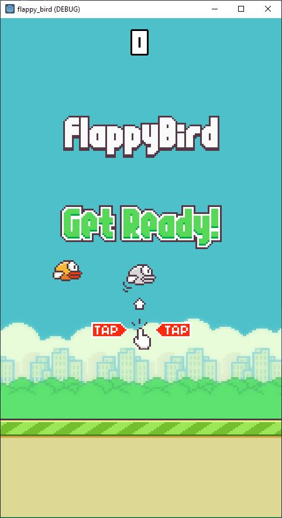

# FlappyBird_clone
A Godot clone of the famous game FlappyBird, done as a project for the course of Kaan Alpar on Skillshare: https://www.skillshare.com/classes/Flappy-Bird-Clone-Godot-Game-Development/1917819725/projects

GDScript used as programming language

  
